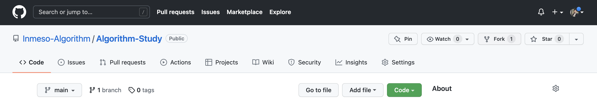
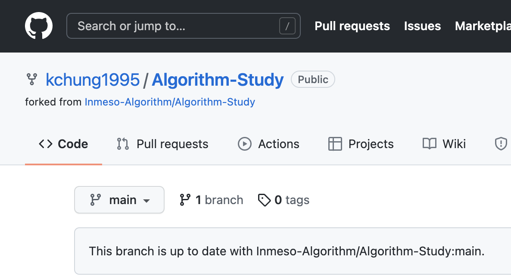
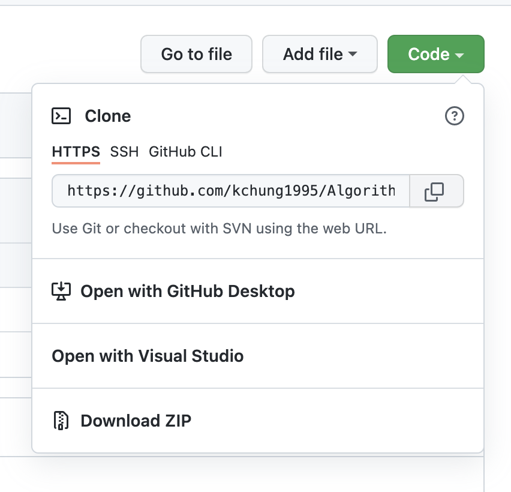
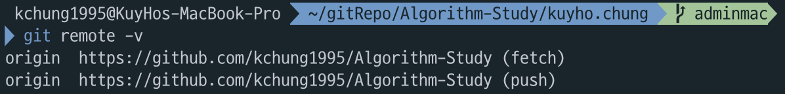
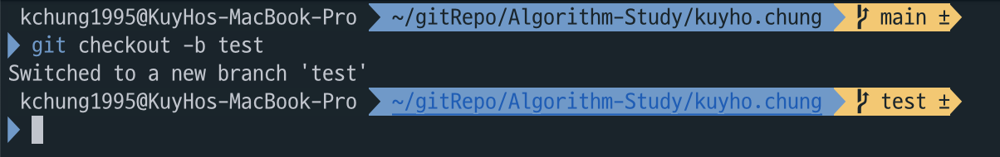

# GitHub 사용 방법

본 저장소 참여를 위한 GitHub 사용 방법을 안내합니다.  
Git에 대한 자세한 내용은 [여기](https://www.opentutorials.org/course/2708)를 통해 확인해 주세요.  
여기서는 Git CLI를 기준으로 설명합니다. (Terminal, Git Bash 등등)

## 목차

- 저장소 fork 및 로컬 환경에 clone 하기
- 원격 저장소 설정
- PR용 branch 생성
- 코드 수정 및 PR 보내기
- PR 승인 이후 branch 삭제
- Fork한 저장소 내용 최신으로 유지

## 저장소 fork 및 로컬 환경에 clone 하기

먼저, 사용하려는 저장소를 GitHub 상에서 `fork` 합니다.



`fork`란, 특정 공개된 저장소를 내 GitHub 내로 그대로 복사해 오는 동작입니다. 복사한 저장소는 원본 저장소와 모든 내용이 같지만, 복사한 저장소에 만든 변경점은 원본 저장소에 반영되지 않습니다 (반영되기를 바란다면 pull request를 보내야 함).  
`fork` 한 저장소는 [https://github.com/본인의 계정명/fork한 저장소명] 이 됩니다.



해당 주소로 접근하면, 정상적으로 `fork` 되었다면, 위 사진처럼 나타나게 됩니다.

이제 이 저장소를 로컬 환경에 가져옵시다. Git에서는 이러한 동작을 `clone`이라고 합니다.  
Git Bash 등의 CLI 기준으로, 원하는 디렉토리에서 아래 명령어를 입력하면 저장소를 해당 위치로 clone할 수 있습니다.

```
$ git clone https://github.com/clone하려는_주소
```

제 저장소를 예시로 든다면, 아래와 같습니다.

```
$ git clone https://github.com/kchung1995/Algorithm-Study.git
```

이 주소는 저장소에서도 아래와 같이 확인할 수 있습니다.



여기까지 완료했다면,

- 공개된 저장소를 내 GitHub 계정으로 복사 (fork) 하였고,
- 이를 로컬 환경에 가져왔습니다 (clone).

## 원격 저장소 설정

아래 명령어를 입력해 보면, clone한 저장소 연결된 원격 저장소의 주소가 나타납니다.

```
git remove -v
```



현재 로컬 환경에서는 fork해둔 저장소에만 연결이 되어 있습니다. 하지만 우리가 개발한 내용을 원본 저장소에 pull request를 보내려면, 해당 저장소의 주소 정보까지 가지고 있어야 합니다.

아래와 같이 원본 저장소의 주소를 추가할 수 있습니다.

```
$ git remote add [name] [address]
```

저장소의 이름을 upstream으로 한다면, 아래와 같이 진행할 수 있습니다.

```
$ git remote add upstream https://github.com/Inmeso-Algorithm/Algorithm-Study.git
```

이후 remote 명령어를 다시 입력하면, upstream까지 정상적으로 등록된 것을 확인할 수 있습니다.

## PR용 branch 생성

branch란, Git에서 생기는 갈래길을 의미합니다.  
main (또는 master) 브랜치는 보통 저장소의 기본 내용을 담고 있으며, 여기에는 바로 수정 사항을 적용하지 않습니다.  
branch를 생성하고, branch 내에서 원하는 만큼 변경 사항을 만든 후, PR을 보내게 됩니다.

새 branch는 아래 명령어로 만들 수 있습니다.

```
$ git checkout -b [branchName]
```

위 명령어를 통해 [branchName] 이라는 브랜치가 새로 생성되며, 현재 위치하고 있는 branch 역시 새로 만든 branch로 이동됩니다.



## 코드 수정 및 PR 보내기

생성한 branch에서 편하게 내용을 추가 및 수정합니다.  
이후 해당 내용을 원격 저장소에 PR을 보내기 위해서는 아래 과정을 거칩니다.

```
$ git add [이번 커밋에 추가할 내용]
```

변경된 점은 `git status` 명령어로 확인할 수 있고, 그 중 일부를 지정하여 추가하거나, `git add .` 명령어를 이용해 변경사항 전체를 추가할 수 있습니다.  
다음으로, 변경점을 commit 합니다.

```
$ git commit -m "[커밋 메세지]"
```

위 명령어를 통해 커밋 메세지를 적고, 커밋할 수 있습니다.  
또는 `git commit` 까지만 입력하면, vim 편집기로 커밋 메세지를 구체적으로 작성할 수도 있습니다.

커밋까지 마쳤다면, PR을 보내도록 합시다.

```
$ git push [저장소명] [브랜치명]
```

위처럼 입력하면, 원격 저장소로 PR 요쳥을 보내게 됩니다. 위에서 설정한 예시대로라면,

```
$ git push origin test
```

가 될 것입니다.

요청한 PR은 아래와 같이 요청을 마무리 해야 합니다.  
GitHub에서 `fork`한 저장소에 접속하면, 아래와 같이 PR 버튼이 활성화 됩니다.  
클릭하고, 필요한 경우 추가 설명을 작성한 후 Send Pull Request를 클릭하면, PR이 마무리 됩니다.

## PR 승인 이후 branch 삭제

PR이 승인 되었다면, local과 remote 환경에서의 branch를 삭제해 줍시다.  
먼저 main branch로 돌아옵니다.

```
$ git checkout main
```

다음으로, 아래 명령어를 차례로 입력합니다.

```
$ git branch -D [branchName]
$ git push origin --delete [branchName]
```

첫 줄은 local, 두 번째 줄은 remote branch를 각각 삭제합니다.

## Fork한 저장소 내용 최신으로 유지

앞의 과정까지 마무리하였다면, 새로 개발한 내용이 원격 원본 저장소에 반영이 되었고, 로컬 환경에서 개발을 위한 branch는 제거하였습니다.  
마지막으로 남은 과정이 fork한 저장소의 내용을 원본 저장소와 똑같이 맞추는 것입니다.

```
$ git fetch upstream
$ git merge upstream/main
$ git push
```

위 명령어를 차례로 입력합니다.  
원본 저장소 (upstream)의 내용을 받아 와서, fork한 저장소와 합치고, 해당 내용을 push하게 됩니다.
